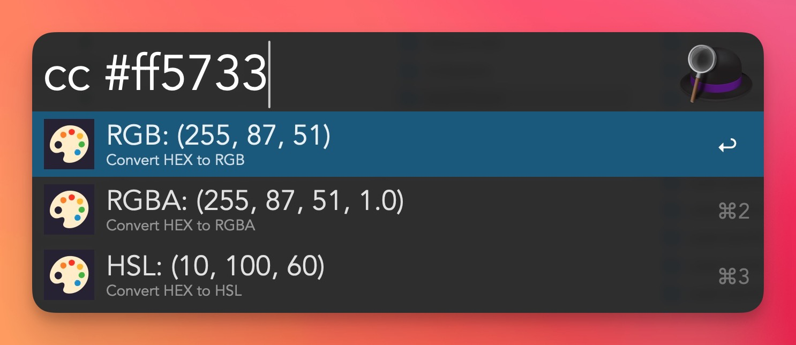

# Color Converter – Alfred Workflow

[Download](https://github.com/asikur22/Color-Converter-Alfred-Workflow/raw/main/Color Converter.alfredworkflow)

Alfred workflow that allows you to convert colors between formats HEX, RGB, RGBA, HSL and copy their values to clipboard. Simple and fast.

The keyword is cc, you can change it with your habit.

**You must have python installed on your computer**

## Features

-   Type `cc #ff5733`, `cc rgb(255,87,51)`, `cc rgba(51,151,217, 1)`, `cc hsl(9,100,60)` etc. to convert color.
-   Displays a list of converted colors code.
-   Press Enter to copy the code to clipboard.

## Formats

-   HEX
-   RGB
-   RGBA
-   HSL

## Preview

